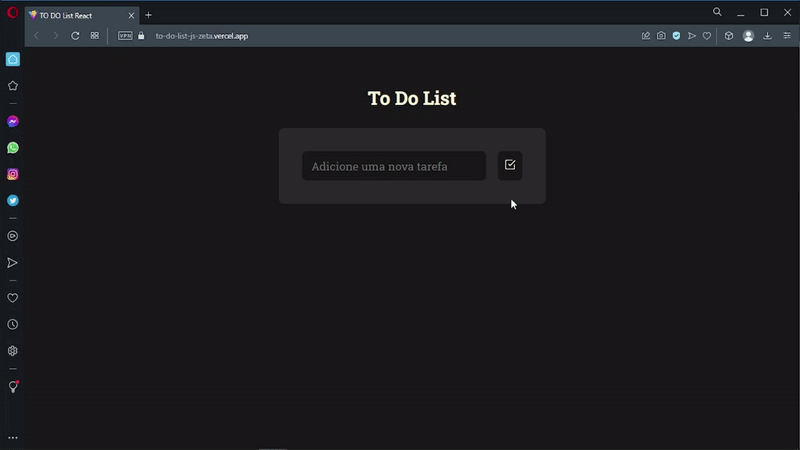

# TO DO List

<h1 align="center">
    
</h1>

<br>

### 💻 TO DO List
A TO DO List webapp with ReactJS. Add Item, Updated item and Delete item.
Add Item - Task can be added to the list of To-Do Tasks.
Update Item - Lists the current list of to-do of the user, has option update task.
delete it from the list altogether.
Delete Item - Delete it from the list.
This project seeks to exercise the concepts learned so far: Logic, HTML, CSS and JavaScript;

Watch it in action Deploy: [Click Here](https://to-do-list-js-zeta.vercel.app/)

What was developed:

- Logic and Algorithms with Javascript;
- Advancing in WEB Programming with ReactJS and Javacript;
- Vite is a new breed of frontend build tool that significantly improves the 
frontend development experience;
- Include popular icons in my React projects easily with react-icons; 
- Mobile version and responsiveness;
- Manipulating the DOM, Objects, Arrays and Events;
- Functions Callback;
- Working with colors and fonts;
- Aligning and positioning text and elements;
- Applying spacing;
- Borders and classification of elements;
- File system structure of the project separated by folder;
  
<br />

## Image from the final application TO DO List:
 

## 🧪 Tools

Application developed using the following tools:

- [ReactJS](https://pt-br.reactjs.org/)
- [Vite](https://github.com/johnpapa/lite-server)
- [React Icons](https://react-icons.github.io/react-icons/)
- [Styled-Components](https://styled-components.com/)
- [HTML5](https://www.w3schools.com/html/default.asp)
- [CSS3](https://www.w3schools.com/css/default.asp)
- [Javascript](https://developer.mozilla.org/pt-BR/docs/Web/JavaScript)
- [Lite server](https://github.com/johnpapa/lite-server)


## 🚀 Getting started

Clone Project and access folder and start the server it is necessary to have nodeJs
installed and Visual Studio Code.

### Programs needed to Getting started

- [NodeJS](https://nodejs.org/en/)
- [Live Server (Opcional)](https://marketplace.visualstudio.com/items?itemName=ritwickdey.LiveServer)
- [Visual Studio Code - Vscode](https://code.visualstudio.com/)

Clone the project and access the folder

```bash
$ git clone https://github.com/felipe-gomes-vicente/to-do-list-react.git
$ cd to-do-list-react
```

## 📝 License

This project is under the MIT license. See the file [LICENSE](LICENSE) for more details.

---

&nbsp;

<p>Done with 💜 by Felipe Vicente👋</p>

## My LinkedIn - [](https://www.linkedin.com/in/felipe-gomes-vicente/)